# 推荐系统

## 召回

### ItemCF

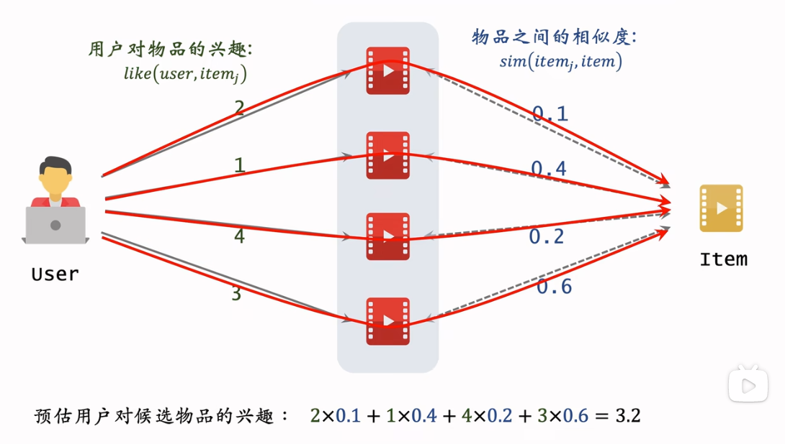

$$score(user, item) = \sum_i(like(user, item_i) \times sim(item_i, item))$$

其中，

* $like(user, item_i)$ 是用户对不同物品的行为权重，比如按时间加权，按点击收藏购买加权
* $sim(item_i, item) = \frac{USER\_LIST_{item1} \cap USER\_LIST_{item2}}{USER\_LIST_{item1} \cup USER\_LIST_{item2}}$

### UserCF

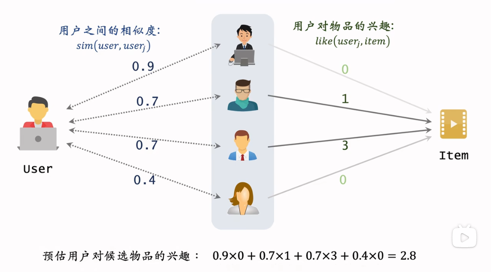

$$score(user, item) = \sum_i(sim(user, user_i) \times like(user_i, item))$$

其中，

* $like(user_i, item)$ 用户 i 对候选物品的兴趣
* $sim(user_i, user) = \frac{ITEM\_LIST_{user1} \cap ITEM\_LIST_{user2}}{ITEM\_LIST_{user1} \cup ITEM\_LIST_{user2}}$

对热门 item 降权 $\frac{1}{\log{1+n}}$

### DSSM 双塔

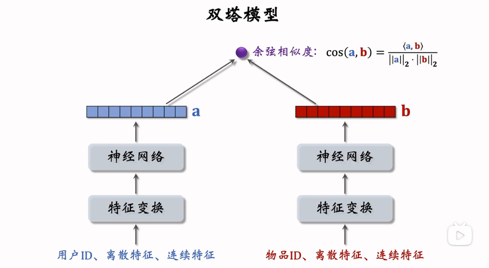

* item embedding：周期性根据 item 特征生成，存入 FAISS 向量数据库，数据库建立索引
* user embedding：根据 user 发起请求时的特征在线生成

使用 user embedding 在 item embedding 中做最近邻查找，返回余弦相似度最大的 k 个物品作为召回结果。

用户的兴趣点时动态变化的，所以要实时计算；物品的特征相对稳定，可以提前存储提高召回性能。

训练：

* pointwise：正负样本二元分类，正:负 = 1:3
* pairwise: a 用户，$b^+$ 正样本，$b^-$ 负样本
  * triplet hinge loss: $L(a,b^+,b^-)=max\{0, cos(a,b^-)+m-cos(a,b^+)\}$
  * triplet logistic loss: $log(1+exp[\sigma \cdot(cos(a,b^-)-cos(a,b^+))])$
* listwise：(一个用户, 一个正样本, 多个负样本)，cross entropy loss

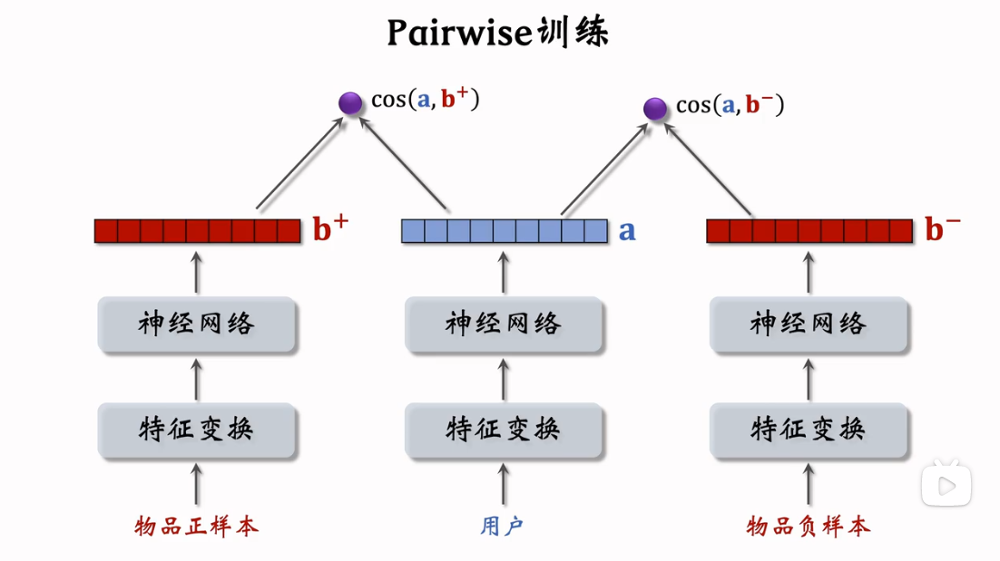
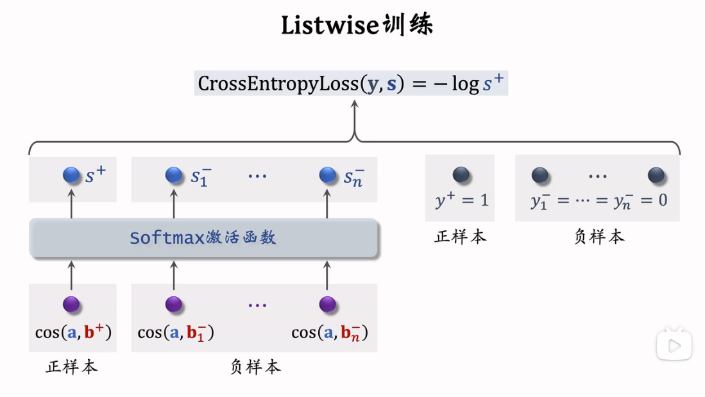

* 正样本：曝光且点击，排除误点、自动播放等。对冷门物品过采样，对热门物品降采样
* 负样本：简单负样本:困难负样本混合 = 4:1
  * 简单负样本：在全部物品中抽样，$抽样概率 \propto (点击次数)^{0.75}$
  * 困难负样本：在排序中分数靠后的物品

在训练、预测时不能使用 user-item 交叉特征。

* 全量更新：今天凌晨用昨天的全天数据（random shuffle）训练模型。在昨天模型参数基础上训练，而不是随机初始化。用昨天的数据只训练 1 epoch。
* 增量更新：用户兴趣会发生变化，需要 online learning 更新 embedding 参数，冻结其他层参数，训练 1 epoch。

既要全量训练，又要增量训练。小时级数据有偏，random shuffle 后的全量训练优于增量训练，增量能捕捉用户兴趣变化。

### Geo Hash

地理位置附近的优质 item

### 关注作者召回

### 缓存召回

召回精排后未曝光的

退场机制：

* 曝光后退场
* 超出缓存大小则移除最先进入缓存的
* item 被召回 10 次后退场
* item 最多保存 3 天

### 评估方法

召回率

每一路召回的占比和 CTR

多路召回去重，按照顺序取最后的召回策略

顺序：热门 -> 标签 -> CF -> item2vec -> DSSM

* 热门
* 地理位置
* 类别/tag
* 关注作者
* itemCF / userCF
* u2i
* i2i
* u2u2i
* i2u2i

## 精排

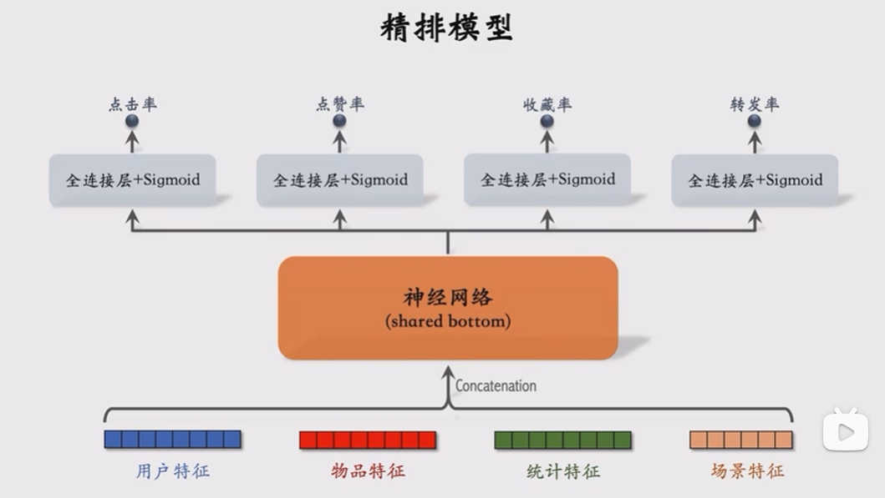

根据模型预估点击率、点赞率、收藏率、转发率等多种分数，加权融合预估分数，根据分数做排序、截断。

### 样本

* 正样本：曝光点击，播放时长筛选，过滤掉用户误点和自动播放
* 负样本：曝光未点击，用户点击 item 以上未点击的 item 做负样本，做降采样

### 特征

* 用户画像
  * 用户 ID（embedding）
  * 人口统计学属性：性别、年龄
  * 账号信息：新老、活跃度
  * 感兴趣的类目、关键词
* 用户统计特征
  * 用户近 1 小时、近 1 天、近 3 天、近 7 天的曝光数、点击数、点赞数、收藏数等
  * 用户对某个类别的行为统计（例如，用户近 7 天对娱乐视频的点击率）
* 用户 last n 行为特征
* 物品画像
  * 物品 ID（embedding）
  * 发布时间
  * GeoHash
  * 标题、类目、关键词
  * 字数、图片数、标签数、清晰度
  * NLP、CV 加工特征
* 物品统计特征
  * 物品近 1 小时、近 1 天、近 3 天、近 7 天的曝光数、点击数、点赞数、收藏数等
  * 按性别、年龄分桶统计
  * 作者特征：发布数量、粉丝数、消费指标（曝光、点击、点赞、收藏）
* 场景特征
  * GeoHash
  * 当前时间段
  * 是否周末、是否节假日
  * 手机品牌、型号、操作系统

特征处理

统一处理为 tag_index:value 形式，每列都是多个键值对组成，且相同列不同行的键值对个数不一定相同。

* 离散特征：剔除生僻的类别，建立字典，将原始数据中的字符串转化为整数 index（例如，`274:1.0`，274表示某类别），然后接入 embedding
* 连续特征：分桶，变成离散特征
  * log 处理，减弱长尾数据的影响
  * min-max scaling，排除不同特征间 scale 的影响（不能做均值为 0 标准差为 1 的标准化，因为这样会破坏数据的稀疏性）

需要关注，特征覆盖率。如果一个特征很重要，需要想办法增加该特征的覆盖率。也需要考虑，特征缺失时的默认值。

### MMOE

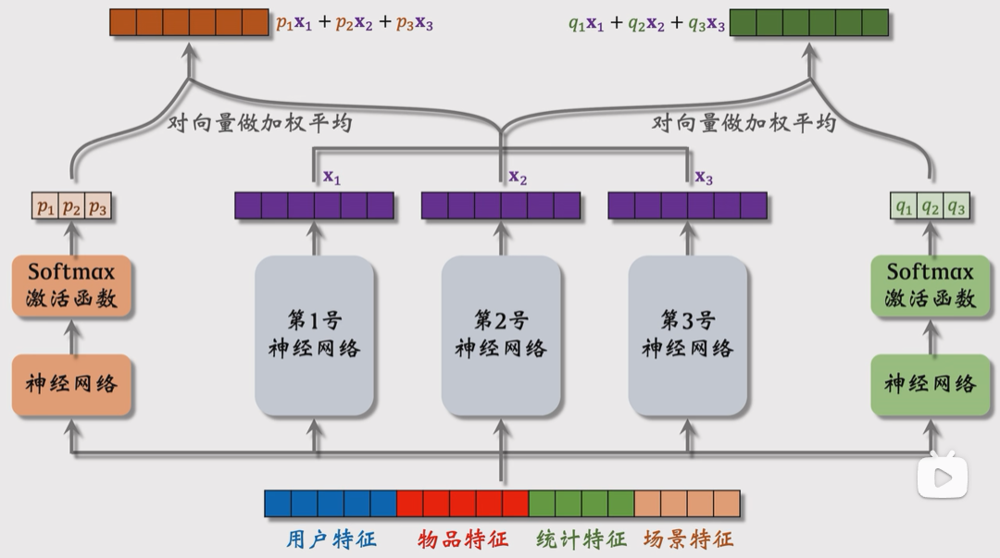

极化现象

使用 dropout 解决

### DCN

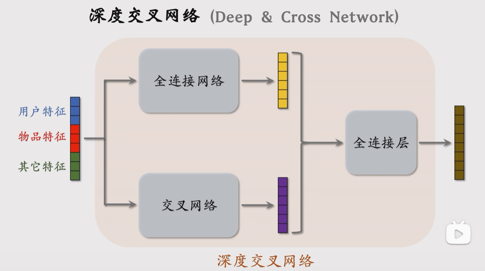
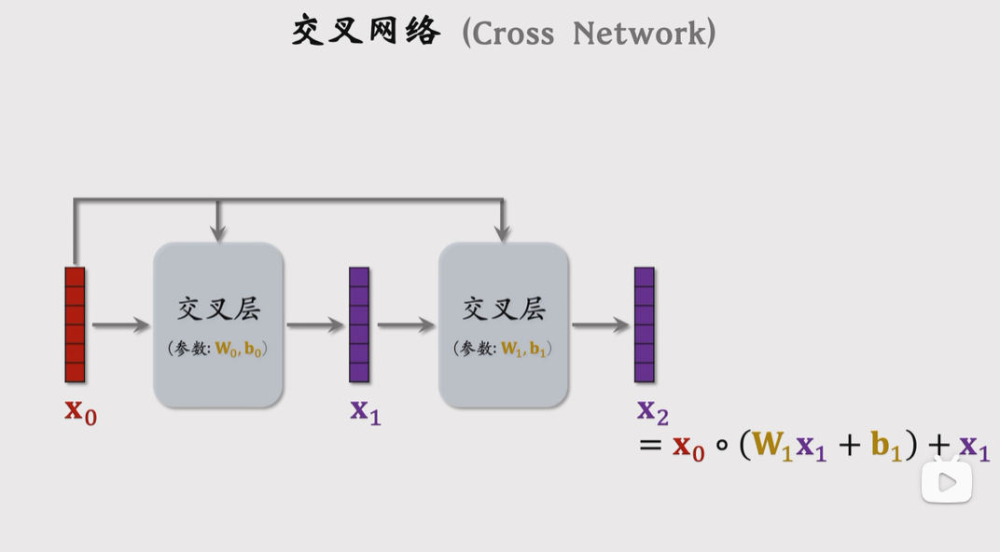

### SENet

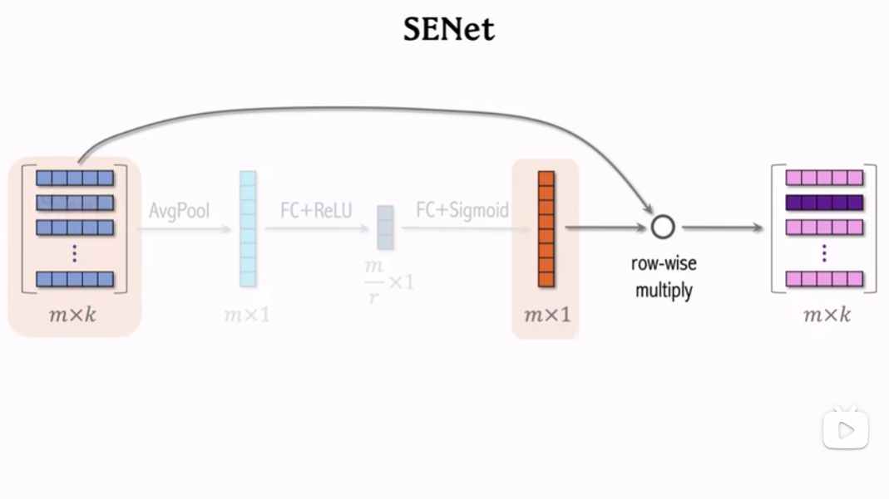

### FiBiNet

### DeepFM

FM 对特征进行二阶交叉，同时引入隐向量（矩阵分解），解决稀疏性问题

DNN 提供告诫特征抽取

共享输入向量

### DIN

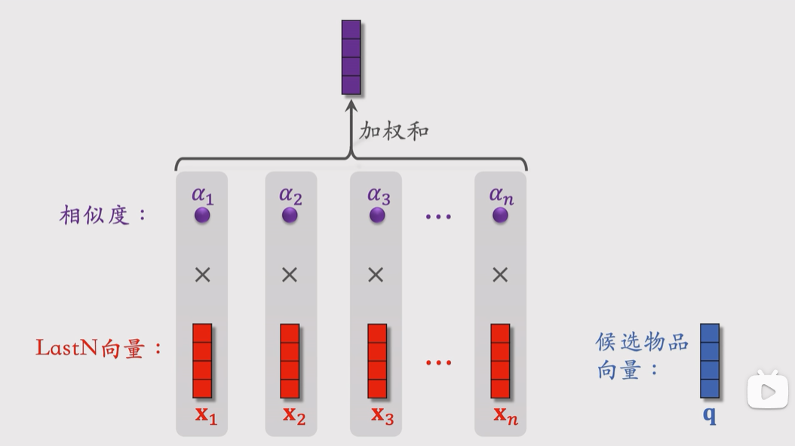

## 指标

### precision / recall

### AUC

GAUC

### LogLoss

$ LogLoss = - \frac{1}{N} \sum_{i=1}^{N} (y_i \log{P_i} + (1 - y_i) \log{(1 - P_i)}) $

* CTR（pv/uv）
* CVR
* 人均点击次数
* 留存率
* 停留时长
* 完播率

### 预估分校准

* 真实点击率：$p_{true}=\frac{n_+}{n_+ + n_-}$
* 预估点击率：$p_{pred}=\frac{n_+}{n_+ + \alpha \cdot n_-}$，其中 $\alpha \in (0,1)$ 为采样率
* 校准点击率：$p_{true}=\frac{\alpha \cdot p_{pred}}{(1-p_{pred}) + \alpha \cdot p_{pred}}$

### 预估分融合

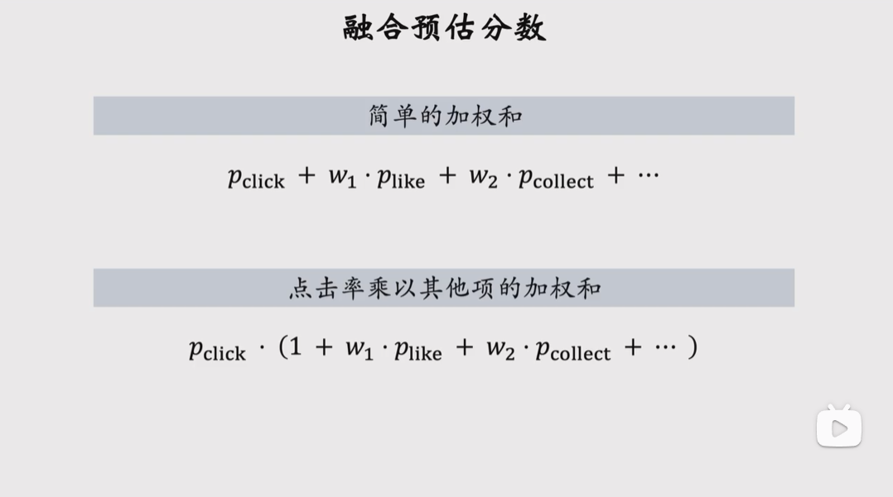
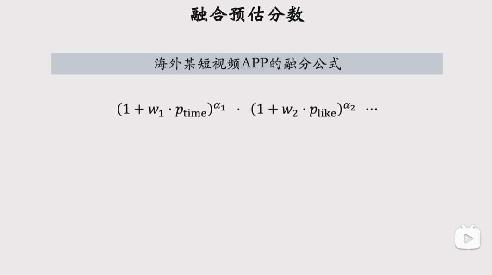
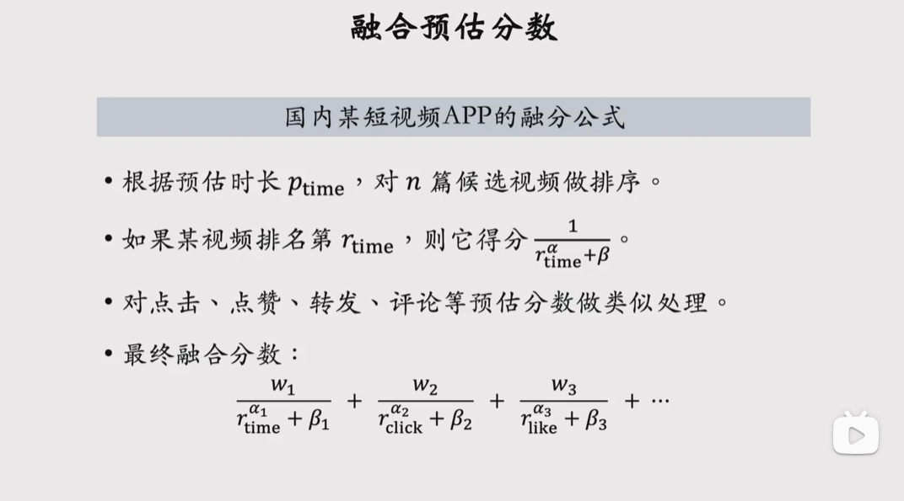
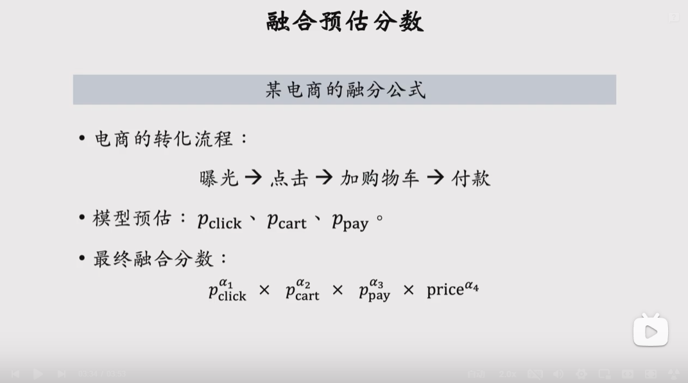

## 粗排

### 三塔

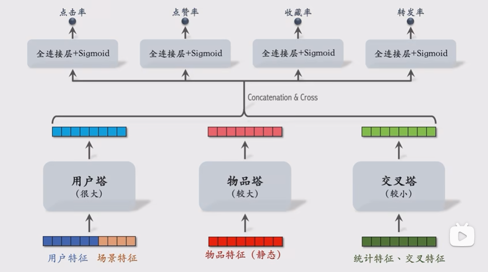
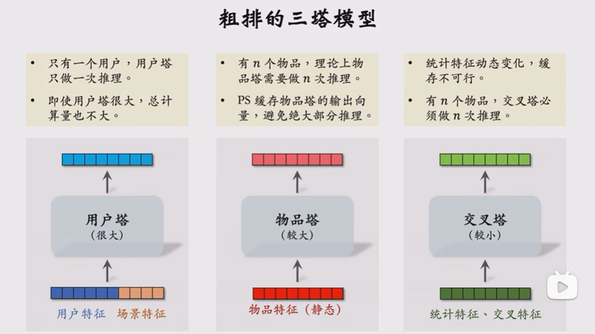

## 重排

冷启动 探索利用

Wide&Deep为什么用了两个优化器分别优化Wide侧和Deep侧？
Wide侧的优化器使用带L1正则化项的FTRL，Deep侧的优化器是AdaGrad。采用 L1 FTRL是想让Wide部分变得更加稀疏，而Deep部分的稀疏向量已经embedding化，所以不用考虑特征稀疏问题。

2 DSSM中的负样本为什么是随机采样得到的，而不用“曝光未点击”当负样本？
仅使用“曝光未点击”当作负样本，会造成训练数据和预测数据不一致的bias。在

3 DNN中加入position bias为什么不能和其他特征一样喂入DNN底层，而必须通过一个浅层网络接入？
我们希望DNN专注于学习user对不同item的偏好，所以bias要交给单独的网络去学，在最后一层融合就好，还有user bias，item bias，都是一样的道理

## 冷启动
