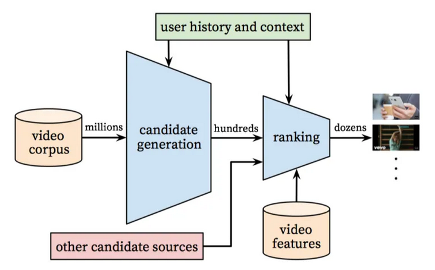
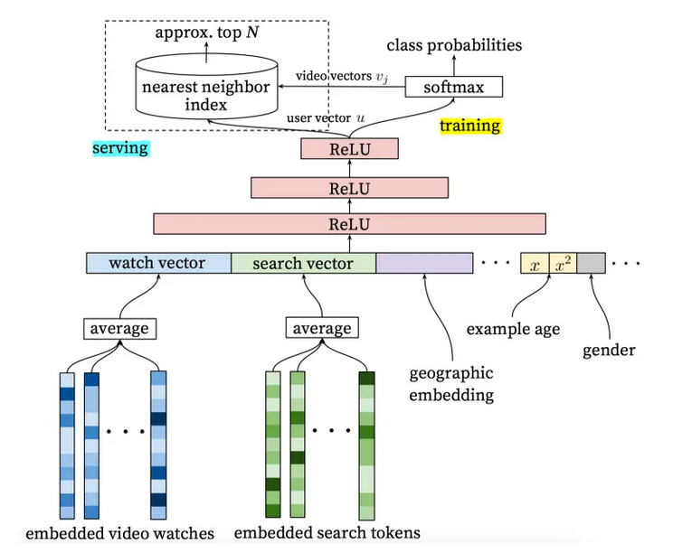
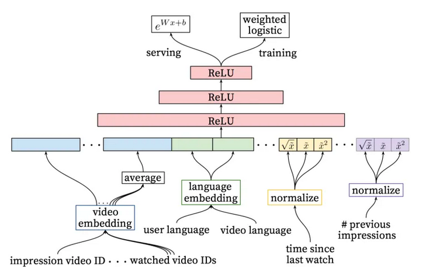

# Youtube DNN

## 整体架构

## 召回

Youtube 将召回过程建模成一个拥有海量类别的多分类问题，类别总数就是视频库中的视频总数，数量在百万级别。

召回使用softmax公式
$$ P(\omega_t = i | U, C) = \frac{e^{v_{i}u}}{\sum_{i \in V}e^{v_ju}} $$
上式是一个标准的softmax公式，表示用户 U 在上下文 C 的情况下，观看第 i 个视频的概率

* V 是视频库中所有视频的集合，数量在百万级别
* $v_i$ 代表第 i 个视频的向量，是需要优化的变量，通过训练才得到
* u 是由“用户特征”与“上下文特征”拼接得到的特征向量，用户历史上看过的视频的向量也是 u 的组成部分

__训练__ 仅取有限的负样本
__召回__ 给定一个用户向量 u，在所有视频向量中，寻找与 u 点积最大的前 N 个视频向量。因为，面对同一个用户 u，所有候选视频计算 softmax 时的分母相同，所以召回时，只需要比较分子的大小。

使用多分类而不是二分类方法建模的原因：

利用 softmax 的互斥性，保证相匹配的视频概率更大，不匹配的视频概率更小。

## 排序

“排序网络”架构与“召回网络”架构极其类似，只不过，使用的特征更加全面，而且由召回时的多分类问题变成“加权的点击率预估”问题。

__重要特征__ 最重要的特征是描述用户与该视频或相似视频的交互历史的特征，比如：

* 用户与该视频所属频道的交互历史，比如，用户在该频道上看了多少视频？
* 用户与该视频具有相同主题的视频的交互历史，比如，用户多久之前才观看了一个有相同主题的视频
* 召回时产生的信息，比如召回源和当时召回源所打的分数

训练时对样本加权，得到对平均观看时长的预测

* 正样本权重：观看时长
* 负样本权重：1
